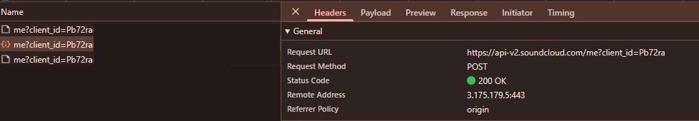

# PixelPlayer

  

  <strong>A beautiful music player for Android</strong> 
  Local library, lyrics, playlists — plus SoundCloud streaming &amp; downloads

  
  
  
  

  
  

---

## Download & install

1. Open **[Latest Release](https://github.com/kibetmasi/PixelPlayer/releases/latest)**.
2. Under **Assets**, download the APK that matches your phone:
   - **`…-arm64-v8a.apk`** — most phones from ~2017 onward (**recommended**)
   - **`…-armeabi-v7a.apk`** — older 32-bit devices
3. On your phone, open the downloaded file and install.
   - If Android blocks it, allow **Install unknown apps** for your browser / Files app.
4. Open PixelPlayer and grant **music / files** access when asked so your local library can load.

> Tip: each new release can update the app **in place** (same signing key). You usually don’t need to uninstall first — that keeps login and settings.

---

## SoundCloud setup

SoundCloud in PixelPlayer needs a **web `client_id`** (from SoundCloud’s website). Signing in alone is not enough for streaming.

### 1. Open SoundCloud settings in the app

1. On **Home**, tap the **cloud** icon and choose **SoundCloud**. The gear on the **SoundCloud** tab opens the same page.
2. You’ll see fields for **client_id**, optional username, and **Sign in**. The SoundCloud tab itself stays in the bottom bar.

### 2. Get a `client_id` from your browser

Do this on a computer (Chrome / Edge / Firefox):

1. Open [https://soundcloud.com](https://soundcloud.com) and play any track (signed in or not).
2. Press **F12** (or right‑click → **Inspect**) to open Developer Tools.
3. Open the **Network** tab.
4. In the filter box, type: `client_id`
5. Click around or pause/play so new requests appear.
6. Click a request to SoundCloud’s API — for example:
   `https://api-v2.soundcloud.com/me?client_id=xxxxxxxxxxxxxxxxxxxxxxxxxxxxxxxx`
7. Copy the long value after `client_id=` (a string of letters and numbers).  
   Yours will look similar but different, and it can change over time.

  

<em>Network → filter <code>client_id</code> → open a request → copy <code>client_id</code> from the Request URL</em>

### 3. Paste it into PixelPlayer

1. Back in **SoundCloud settings**, paste the value into **Web client_id**.
2. Tap **Save SoundCloud settings**.
3. (Recommended) Tap **Sign in to SoundCloud**, log in in the browser window, then confirm you’re signed in.
4. Return to the SoundCloud tab — Feed / Likes / playlists should load after a moment.

### If something fails

| Message / symptom | What to try |
|-------------------|-------------|
| “Set client_id in Settings…” | Paste a fresh `client_id` from the steps above and Save. |
| “Rate limited” / API 429 | Wait a minute, then try again. Don’t spam refresh. |
| “No playable stream” | Track may be DRM-only, or `client_id` expired — grab a new one. |
| Empty Feed while signed in | Sign out/in again; confirm Save after pasting `client_id`. |

> `client_id` can expire when SoundCloud updates their site. If streaming suddenly stops, repeat step 2 and Save again.

---

## Everyday use (quick)

- **Library** — your local music (songs, albums, artists, playlists, folders).
- **SoundCloud** — Feed, Discover, Likes, Tracks, Playlists, Downloads; search or paste a SoundCloud URL.
- **Downloads** — long-press to multi-select (play, queue, next, playlist, delete, share ZIP).
- Share a track/playlist from SoundCloud with the **share** icon — sends the **web link**.

---

## Requirements

- Android **11** or newer  
- Storage / music permission for local files  
- Internet for SoundCloud

---

## Support & credits

This build is maintained at **[kibetmasi/PixelPlayer](https://github.com/kibetmasi/PixelPlayer)** (SoundCloud-focused fork).

Upstream project by [theovilardo](https://github.com/theovilardo/PixelPlayer). Logo by [Aureal](https://github.com/NPSummers).

See [LICENSE](LICENSE) and [THIRD_PARTY_NOTICES.md](THIRD_PARTY_NOTICES.md).
